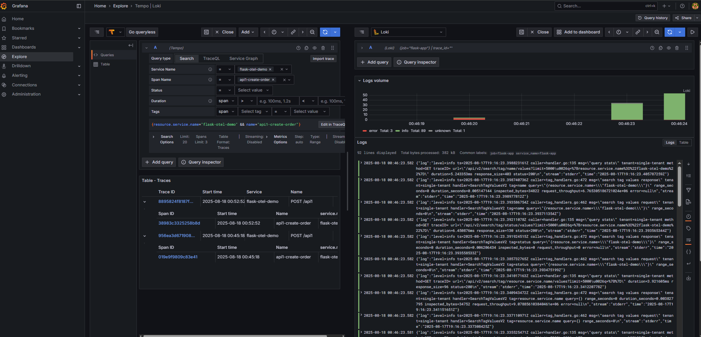

docker compose up -d promtail


# 📊 Flask OTEL Grafana Demo

This project demonstrates **end-to-end observability** for a Flask app using:

- **OpenTelemetry** (instrumentation, traces, logging)
- **Tempo** (distributed tracing backend)
- **Loki + Promtail** (log aggregation)
- **Grafana** (visualization and correlation)

---

## 🚀 Getting Started

### 1. Clone the repo

```bash
git clone https://github.com/nathdiptanu/flask-otel-grafana-demo.git
cd flask-otel-grafana-demo
```

### 2. Start the stack

```bash
docker-compose up -d --build
```

This will start:

- Flask app (port **8000**)
- Grafana (port **3000**)
- Loki (port **3100**)
- Tempo (port **3200**)
- Promtail (for log scraping)

---

## ✅ Health Checks

### Check if Loki is ready
```bash
curl http://localhost:3100/ready
```
Expected output:
```
ready
```

### Check Flask health endpoint
```bash
curl http://localhost:8000/health
```
Expected output:
```json
{"status":"ok"}
```

---

## 🧪 Generate Sample Traffic

Send requests to the app:

```bash
# Hello endpoint
curl "http://localhost:8000/hello?name=Grafana"

# Work endpoint (generates nested spans)
curl http://localhost:8000/work

# Error endpoint (shows exception traces)
curl http://localhost:8000/error
```

---

## 📜 Logs

Check Promtail logs to ensure log shipping:

```bash
docker logs promtail --tail=50
```

---

## 📈 Grafana

1. Open Grafana → [http://localhost:3000](http://localhost:3000)  
   Login: `admin / admin`

2. Explore → **Loki**  
   Run query:
   ```logql
   {job="flask-app"}
   ```

   You should see logs with `trace_id` and `span_id`.

3. Explore → **Tempo**  
   - Select a trace.
   - Click **Logs for this span** → You should see matching logs from Loki.

---

## 🔄 Restart Services

If you change configs (Promtail, Grafana, Loki, etc.):

```bash
docker-compose restart grafana promtail loki tempo app
```

If only Grafana provisioning changed:

```bash
docker-compose restart grafana
```

---

## 🧰 Useful Debug Commands

```bash
# View logs of a container
docker logs <container_name> --tail=100

# Rebuild and restart everything
docker-compose up -d --build

# Stop everything
docker-compose down
```

---

## 🔍 Project Structure

```
flask-otel-grafana-demo/
├─ docker-compose.yml
├─ grafana/
│  └─ provisioning/
│     ├─ datasources/
│     │  └─ datasources.yml
│     └─ dashboards/
│        └─ dashboards.yml
├─ loki/
│  └─ config.yml
├─ promtail/
│  └─ config.yml
├─ tempo/
│  └─ config.yml
└─ app/
   ├─ Dockerfile
   ├─ requirements.txt
   ├─ wsgi.py
   └─ app.py
```

---

## 🛠️ Troubleshooting

### 1. Grafana shows "No logs volume available"
- Cause: Wrong **derivedFields** or **tracesToLogs** query in `datasources.yml`.
- Fix: Ensure Loki derived field regex matches `trace_id=([a-f0-9]{32})` and Tempo uses the same UID.
- Restart Grafana after editing:
  ```bash
  docker-compose restart grafana
  ```

### 2. Trace ID not appearing in logs
- Cause: Logging formatter not injecting trace/span IDs.
- Fix: Check `app.py` logging config → Ensure `trace_id=%(trace_id)s span_id=%(span_id)s` is in log format.

### 3. No traces in Tempo
- Cause: Flask not exporting spans or Tempo not receiving.
- Fix:
  - Check Flask container logs: `docker logs app --tail=100`
  - Ensure OTLP exporter endpoint matches `http://tempo:4318/v1/traces` inside Docker.

### 4. Promtail not scraping logs
- Cause: Wrong Promtail config or missing Docker labels.
- Fix: Check promtail logs:
  ```bash
  docker logs promtail --tail=100
  ```

### 5. Grafana cannot connect to Loki/Tempo
- Cause: Wrong service name in `docker-compose.yml` or provisioning.
- Fix:
  - Loki URL → `http://loki:3100`
  - Tempo URL → `http://tempo:3200`
  - Restart Grafana.

---

✅ With this, you have **traces, logs, and metrics correlated** in Grafana! 🎉

docker-compose build app && docker-compose up -d


    docker logs -f flask-app  
    docker-compose down -v    
    docker-compose up --build 


    echo "# flask-otel-grafana-demo" >> README.md
    git init
    git add README.md
    git commit -m "first commit"
    git branch -M main
    git remote add origin https://github.com/nathdiptanu/flask-otel-grafana-demo.git
    git push -u origin main
    …or push an existing repository from the command line
    git remote add origin https://github.com/nathdiptanu/flask-otel-grafana-demo.git
    git branch -M main
    git push -u origin main


